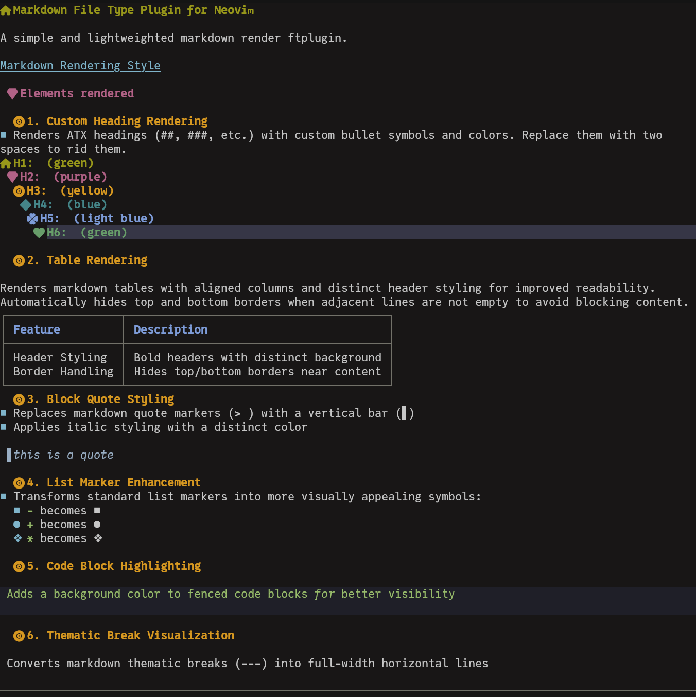

# Markdown File Type Plugin for Neovim

A simple and lightweighted markdown render ftplugin.



## Elements rendered 

### 1. Custom Heading Rendering
- Renders ATX headings (##, ###, etc.) with custom bullet symbols and colors. Replace them with two spaces to rid them.

### 2. Table Rendering

Renders markdown tables with aligned columns and distinct header styling for improved readability. Automatically hides top and bottom borders when adjacent lines are not empty to avoid blocking content.

| Feature          | Description                              |
|------------------|------------------------------------------|
| Header Styling   | Bold headers with distinct background    |
| Border Handling  | Hides top/bottom borders near content    |

### 3. Block Quote Styling
- Replaces markdown quote markers (> ) with a vertical bar (▋)
- Applies italic styling with a distinct color

> this is a quote

### 4. List Marker Enhancement
- Transforms standard list markers into more visually appealing symbols:
  - `-` becomes ■
  + `+` becomes ●
  * `*` becomes ❖

### 5. Code Block Highlighting

```Python
 Adds a background color to fenced code blocks for better visibility

```

### 6. Thematic Break Visualization

 Converts markdown thematic breaks (---) into full-width horizontal lines

---
## Installation

Simply place `markdown.lua` in your Neovim's `ftplugin` directory (typically `~/.config/nvim/ftplugin/`). 

## How It Works

The plugin uses Tree-sitter to parse markdown files and applies extmarks with virtual text to render elements visually. It leverages Neovim's conceal feature to hide original markdown syntax while displaying the enhanced visual elements. To reveal the orginal, put them in visual mode. 

## Customization

Colors and symbols can be customized by modifying the `heading_styles` and `bullets` tables in the plugin file. The plugin also defines several highlight groups that can be overridden in your Neovim configuration or in this file. Change the delay to 0 if want the rendering to be immediate. The default delay is 0.2 sec.

## License

This project is licensed under the MIT License - see the [LICENSE](LICENSE) file for details.
